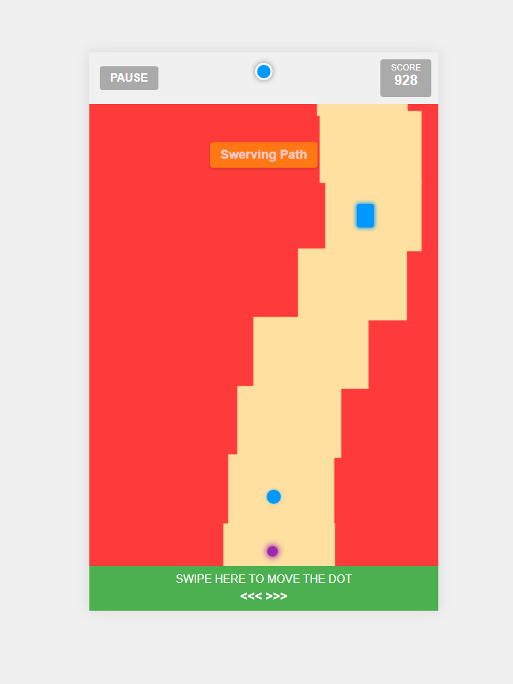

# The Line - Game Jam

A web-based game inspired by "The Line" by Ketchapp, featuring a blue dot navigating a path while avoiding obstacles. This game was created as part of an AI Game Jam.



## Game Description

In "The Line", you control a colored dot that must navigate a continuously scrolling path. The game features:

- Smooth vertical scrolling with procedurally generated path segments
- Color-matching mechanics (toggle between blue and green)
- Obstacles that must be matched with your dot's color
- Bullets that fall from the top of the screen
- Increasing difficulty as your score grows

## How to Play

1. **Objective**: Navigate the path, avoid falling off, and dodge or match colors with obstacles to achieve the highest score.

2. **Controls**:
   - **Mouse/Touch**: Move the dot by dragging or swiping on the screen
   - **Tap/Click**: Toggle between blue and green colors

3. **Game Mechanics**:
   - Stay on the path - falling off results in game over
   - Match your dot's color with obstacles to earn bonus points
   - Avoid obstacles of the opposite color
   - Dodge bullets that fall from the top of the screen
   - The game speed increases as your score grows

## Features

- **Procedural Path Generation**: The path is generated segment by segment, ensuring there are no dead ends
- **Color Matching**: Toggle between blue and green to match obstacles
- **Varying Path Widths**: Path segments vary in width for added challenge
- **Bullet System**: Dodge bullets that target your position
- **Visual Indicators**: Warning indicators show where bullets will fall
- **Responsive Design**: Works on both desktop and mobile devices

## Technical Implementation

- Pure JavaScript, HTML, and CSS - no external libraries
- Collision detection using circle-to-rectangle and circle-to-circle algorithms
- Normalized coordinate system for consistent gameplay across screen sizes
- Optimized rendering using CSS transforms
- Efficient memory management with proper cleanup of game elements

## Running the Game

Simply open `index.html` in any modern web browser to play the game.

```
# Clone the repository
git clone https://github.com/yourusername/the-line-game.git

# Navigate to the project directory
cd the-line-game

# Open index.html in your browser
```

## Development

The game consists of three main files:
- `index.html`: The game's HTML structure
- `style.css`: All styling and animations
- `script.js`: Game logic and mechanics

## License

MIT License - Feel free to use, modify, and distribute this code.

## Credits

Created as part of an AI Game Jam using Claude 3.7 Sonnet. 